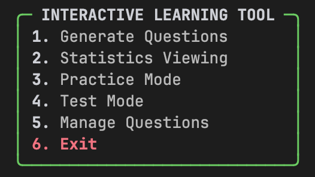

# Interactive Learning Tool

An advanced educational tool that uses OpenAI's GPT models to generate study questions, guide practice sessions, and evaluate user performance through structured data validation and a modern, stylized CLI interface.


## Setup & Usage
**Python 3.11+ required**

1. **Install Dependencies**:
   ```bash
   pip install -r requirements.txt
   ```
2. **Configuration**: Create a `.env` file in the project root:
   ```env
   OPENAI_API_KEY="your_actual_api_key_here"
   ```
3. **Launch Application**:
   ```bash
   python main.py
   ```
4. **Run Automated Tests**:
   ```bash
   python3 -m pytest
   ```
5. **Type Checking**:
   ```bash
   mypy src main.py
   ```
6. **Code Formatting**:
   ```bash
   black .
   ```

## Project Structure
```text
interactive-learning-tool/
├── assets/                     # Visual documentation (App screenshots)
├── data/                       # Persistent storage (JSON questions, TXT results)
├── src/                        # Source code
│   ├── __init__.py             # Package initialization
│   ├── config.py               # Pydantic Settings & Environment management
│   ├── llm_client.py           # OpenAI Structured Output integration
│   ├── models.py               # OOP Domain models (Inheritance)
│   ├── prompts.py              # Externalized LLM instructions
│   ├── question_generator.py   # AI generation logic
│   ├── quiz_manager.py         # Core business logic & Algorithms
│   ├── repository.py           # Data access layer (Repository Pattern)
│   └── ui_handler.py           # Advanced CLI Presentation (Rich library)
├── tests/                      # Automated Pytest suite
│   ├── __init__.py             # Test package initialization
│   ├── test_models.py
│   ├── test_question_generator.py
│   ├── test_quiz_manager.py
│   └── test_repository.py
├── main.py                     # Application entry point
├── .env                        # API Credentials (ignored by Git)
├── .gitignore                  # Git exclusion rules
├── requirements.txt            # Project dependencies
└── README.md                   # Project documentation
```

## Preview


## Feature Coverage

### Official Requirements 
- [x] **Generate Questions Mode**: Intelligent topic-based creation of MCQ and Freeform questions via LLM.
- [x] **Validation UI**: Interactive review loop allowing users to accept, reject, or manually modify generated questions.
- [x] **Practice Mode**: Smart question selection using a weighted random algorithm based on historical user performance.
- [x] **Test Mode**: Randomized assessment sessions with automatic score calculation and persistent logging.
- [x] **Manage Questions**: Comprehensive control system to list and toggle question status (Active/Disabled).
- [x] **Statistics Viewing**: Detailed tabular presentation of success rates, source information, and usage frequency.
- [x] **Data Persistence**: Full storage of questions, statistics, and results using JSON and flat-file systems.

### Technical Extra Improvements 
- **Structured Outputs**: Native integration with OpenAI's `beta.chat.completions.parse` and Pydantic, ensuring schema-validated LLM outputs and safer parsing.
- **Modern CLI Experience**: Leveraged the `Rich` library to provide stylized panels, adaptive-width layouts (`Panel.fit`), and professional-grade tables with rounded corners.
- **Interactive UX Feedbacks**: Implemented animated loading spinners using Python **Context Managers** to maintain responsiveness during API calls.
- **Type-Safe Configuration**: Utilized `pydantic-settings` for centralized, validated management of environment variables and global constants.
- **Professional Logging**: Integrated `loguru` for robust system diagnostics, providing structured error tracking separate from the user interface.
- **Architectural Purity (DRY)**: Unified the presentation layer into a dedicated `UIHandler` to eliminate code duplication across different game modes.

## Design Philosophy

This project was developed with a strong emphasis on clean architecture, testability, and long-term maintainability.  
Design decisions deliberately prioritize explicit data models, type safety, and separation of concerns over rapid prototyping shortcuts.

## Architectural Decisions & Assumptions

### Key Assumptions
- **User Environment**: The user is expected to have a valid OpenAI API key with access to the `gpt-4o` model.
- **Data Volume**: JSON-based persistence assumes a moderate number of questions. For larger datasets, a relational database would be more appropriate.
- **Terminal Capabilities**: The CLI assumes a modern terminal emulator with Unicode and 256-color support (required by the Rich library).
- **Answer Evaluation Logic**:  
  - MCQ answers are evaluated via strict string matching.  
  - Freeform answers rely on the LLM as the source of truth for semantic correctness.

### Design Decisions
- **Repository Pattern**: Adopted to decouple business logic from persistence details, allowing seamless replacement of JSON storage with SQL or other backends.
- **Inheritance-Based Modeling**: An Abstract Base Class (`Question`) enforces a strict contract across question types while enabling polymorphic behavior.
- **Pydantic Schemas**: Used to enforce structured, validated data contracts between the LLM and application logic, preventing malformed responses from propagating.
- **Separation of Concerns**: UI rendering, LLM communication, business logic, and data access are strictly isolated into dedicated modules to maximize maintainability and testability.

## Testing Strategy
The project maintains a high-quality test suite using `pytest` and `unittest.mock`:
- **Isolation**: Business logic is tested independently of the OpenAI API and the file system.
- **Coverage**: Includes validation for weighted selection algorithms, JSON serialization integrity, and Pydantic model transformations.

## Previous Work
**Previous hands-on project repository**: [Link to Repository](https://github.com/lmguerrini/dnd-game)